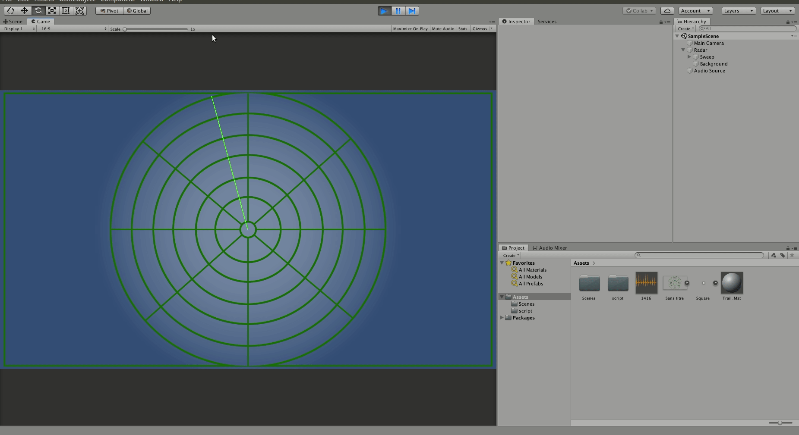

#### Le projet est réalisé  par :
###### BALIT Habib
###### ROUMILI Lamia

#### Lancement de l'application :
* Lancer le code sur l'arduino graçce à son ide
* Lancer l'interface sur unity

#### Le schéma fait sur https://www.tinkercad.com/ 

#### Le schéma réel 

#### Interface graphique Unity version 1

#### Interface graphique Unity version 2

#### Interface graphique Unity version 3

#### Interface graphique version 4

Pour lancer l'application :
* installer https://processing.org/download/ afin de lancer l'application graphique, à l'aide du code source de https://supertech.yt/fabriquer-un-radar-a-ultrasons-arduino/

#### Une vidéo représentative dans le dossier /images/video_1.mp4.

#### La communication réelle est faite dans la version 3 et 4, mais par manque de temps on n'a pas fini toutes les versions.
